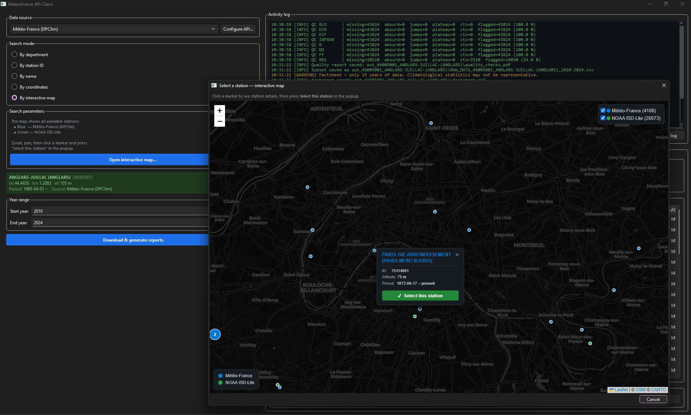

# MeteoFrance API Client

A Python tool for downloading, processing, and reporting hourly surface
meteorological data from two complementary sources:

- **Météo-France DPClim** — French national network (~4 000 stations,
  French metropolitan territory + overseas).
- **NOAA ISD-Lite** — NCEI Integrated Surface Database (~26 000 stations
  worldwide, hourly data back to the 1970s for major airports).

For each selected station the tool produces:

1. A commented CSV file with the processed hourly dataset.
2. A multi-page quality-control PDF (`quality_checks.pdf`).
3. A climatological factsheet PDF (`factsheet.pdf`).

Two interfaces are available: a **graphical interface** (PyQt6) and a
**command-line interface**.

---

## Windows Executable (no Python required)

> For users who do not have Python installed.

**[Download MeteoFrance_Client_v1.0.0.zip](https://github.com/Samy-K/MeteoFrance_API_Client/releases/download/v1.0.0/MeteoFrance_Client_v1.0.0.zip)**

1. Extract the zip — you get `MeteoFrance_Client.exe` and `API_config.txt`
2. Edit `API_config.txt` and paste your Météo-France token (see [token setup](#météo-france-api-token--step-by-step))
3. Run `MeteoFrance_Client.exe`

All releases: <https://github.com/Samy-K/MeteoFrance_API_Client/releases>



---

## Table of Contents

- [Windows Executable](#windows-executable-no-python-required)
- [Requirements](#requirements)
- [Installation](#installation)
- [Configuration](#configuration) — [Météo-France token setup](#météo-france-api-token--step-by-step)
- [First-time setup — station catalogues](#first-time-setup--station-catalogues)
- [Usage — GUI](#usage--gui)
- [Usage — CLI](#usage--cli)
- [Output files](#output-files)
- [Architecture](#architecture)
- [Data sources and variables](#data-sources-and-variables)
- [Quality control methodology](#quality-control-methodology)
- [License](#license)

---

## Requirements

- Python ≥ 3.10
- [`pandas`](https://pandas.pydata.org/) ≥ 2.0
- [`requests`](https://docs.python-requests.org/)
- [`matplotlib`](https://matplotlib.org/)
- [`numpy`](https://numpy.org/)
- [`PyQt6`](https://pypi.org/project/PyQt6/) ≥ 6.5 *(GUI only)*
- [`PyQt6-WebEngine`](https://pypi.org/project/PyQt6-WebEngine/) ≥ 6.5 *(interactive map)*

---

## Installation

```bash
git clone https://github.com/Samy-K/MF_API_CLIENT.git
cd MF_API_CLIENT
pip install -r requirements.txt
```

---

## Configuration

### Météo-France API token — step by step

> The NOAA ISD-Lite source requires **no credentials** — skip this section if
> you only need worldwide NOAA data.

1. **Create an account** at <https://portail-api.meteofrance.fr/web/en/>

2. **Subscribe to the Climatological Data API** (free):  
   *Climatology → Climatological data → Subscribe for free*

3. **Generate a token**:  
   Go to <https://portail-api.meteofrance.fr/web/en/dashboard>  
   (*Account → My APIs*), then click **Generate Token** and copy the result.

4. **Set the token** — choose one of:
   - Open `API_config.txt` and paste the token after `TOKEN =`
   - In the GUI, click **Configure API…** and paste it into the *TOKEN* field,
     then click *Save*

```ini
[Parameters]
APPLICATION_ID =                                               ; leave blank if using token only
DATA_SERVER    = https://public-api.meteofrance.fr/public/DPClim/v1
TOKEN          = <paste your token here>
```

> **Token lifetime**: static tokens do not expire, but can be revoked and
> regenerated from the dashboard at any time.  
> If you also set `APPLICATION_ID` (OAuth2 client credentials), the client
> automatically fetches a fresh token on any HTTP 401 response.

---

## First-time setup — station catalogues

Two local catalogue files are required before the main application can run.

### Météo-France stations (~25 min)

Queries the DPClim API for all ~4 000 stations across all departments:

```bash
python src/fetch_mf_stations.py
```

Output: `weather_stations_infos/mf_stations.csv`

The script supports **resume/checkpoint**: if interrupted, re-running it
skips already-fetched stations and appends new rows.

### NOAA ISD stations (a few seconds)

Downloads the public NOAA ISD catalogue in a single HTTP request:

```bash
python src/fetch_isd_stations.py
```

Output: `weather_stations_infos/isd_stations.csv`

Re-run at any time to refresh the catalogue.

---

## Usage — GUI

```bash
python main_gui.py
```

The graphical interface is the recommended entry point.

### Layout

The window is split into two panels:

- **Left panel** — configuration: data source, API credentials, station
  search, year range, and download button.
- **Right panel** — activity log (live, colour-coded by log level) and
  results panel (dataset preview + PDF report buttons).

### Station selection

Five search modes are available, selectable via radio buttons:

| Mode | Description |
|------|-------------|
| **By interactive map** *(default)* | Opens a full-screen Leaflet.js map with all MF (blue) and ISD (green) stations. Click a marker, then press *Select this station* in the popup. |
| By department | Lists all MF stations in a chosen French department. |
| By station ID | Direct entry of a known DPClim station ID. |
| By name | Substring search in the local station catalogue. |
| By coordinates | Finds the 10 nearest stations (Haversine distance). |

When a station is selected from the interactive map, the **data source
combo is updated automatically** to match the selected station (MF or ISD),
regardless of the previously active source.

### Download and reports

1. Select a station and adjust the year range.
2. Click **Download & generate reports**.
3. The download runs in a background thread — the log panel streams progress
   in real time.
4. On completion the results panel shows a station summary, a dataset preview
   (first 50 rows), and buttons to open the generated PDFs.

---

## Usage — CLI

```bash
python main.py
```

The script is fully interactive:

```
  Select data source:
    [1]  Météo-France  (DPClim API — French stations)
    [2]  NOAA ISD-Lite (Integrated Surface Database — worldwide)
```

### Météo-France flow

1. Choose a station selection mode:
   - **By department** — lists all stations in a French department.
   - **By station ID** — direct entry of a known DPClim ID.
   - **By name** — substring search (requires `mf_stations.csv`).
   - **By coordinates** — finds the 10 nearest stations (requires `mf_stations.csv`).
2. Confirm the year range.
3. Confirm the order placement.
4. The script places one order per year, polls for readiness, and downloads
   the CSV files.

### NOAA ISD flow

1. Choose a station search mode:
   - **By name** — case-insensitive substring search.
   - **By coordinates** — finds the 10 nearest stations (Haversine distance).
2. Confirm the year range.
3. The script downloads and decompresses one `.gz` file per year directly
   into memory — no intermediate files.

### Coordinate input formats

| Format | Example | Notes |
|--------|---------|-------|
| Decimal, dot separator | `48.85` / `-2.35` | Standard decimal notation |
| Decimal, comma separator | `48,85` / `-2,35` | French locale style |
| With degree symbol | `48.85°` / `48,85°` | Degree sign optional |
| With cardinal suffix | `44.38°N` / `4.64°E` | N/S/E/W appended |
| With space before cardinal | `44.38° N` / `4.64° E` | Space between ° and letter |
| South / West → negative | `44.38°S` → `-44.38` / `4.64°W` → `-4.64` | S and W flip the sign |

---

## Output files

All outputs are written to a directory named `out_{station_id}_{station_name}/`:

| File | Description |
|------|-------------|
| `RAW_DATA_{id}_{name}_{start}-{end}.csv` | Processed hourly dataset with `#`-prefixed station metadata header and per-variable quality-flag columns (`FLAG_T`, `FLAG_FF`, …). |
| `quality_checks.pdf` | Multi-page quality-control report (cover + coherence page + one page per variable). |
| `factsheet.pdf` | Climatological factsheet (cover + one page per variable group). |
| `figures/*.png` | Individual figure exports (one per PDF page, 150 dpi). |

---

## Architecture

### Entry points

| File | Description |
|------|-------------|
| `main_gui.py` | GUI entry point (PyQt6) |
| `main.py` | CLI entry point |

### Core modules (`src/`)

| File | Description |
|------|-------------|
| `mf_client.py` | Météo-France DPClim API client — token and OAuth2 auth, order placement, polling |
| `isd_client.py` | NOAA ISD-Lite client — catalogue search, yearly `.gz` download and parsing |
| `data_handler.py` | `DatasetManager` — subset, quality flags, CSV export |
| `data_quality_report.py` | Quality-control PDF generator |
| `data_facts_report.py` | Climatological factsheet PDF generator |
| `station_selector.py` | Station catalogue helpers shared by the CLI and GUI |
| `utils.py` | Shared utilities — Mann-Kendall trend test, solar geometry, coordinate parsing |
| `fetch_mf_stations.py` | One-time script — builds `mf_stations.csv` (resume/checkpoint supported) |
| `fetch_isd_stations.py` | One-time script — builds `isd_stations.csv` |

### GUI modules (`src/gui/`)

| File | Description |
|------|-------------|
| `main_window.py` | `MainWindow` — top-level window, log handler, API config dialog |
| `station_selector_widget.py` | Station search widget — all five search modes |
| `map_widget.py` | Leaflet.js interactive map (`MapWidget` + `MapDialog`) |
| `download_worker.py` | Background download thread (`QThread`) |
| `results_widget.py` | Results panel — dataset preview and PDF report buttons |

### Data files

| File | Description |
|------|-------------|
| `weather_stations_infos/mf_stations.csv` | Météo-France station catalogue (generated by `fetch_mf_stations.py`) |
| `weather_stations_infos/isd_stations.csv` | NOAA ISD station catalogue (generated by `fetch_isd_stations.py`) |
| `API_config.txt` | Météo-France API credentials (not committed to git) |

---

## Data sources and variables

### Météo-France DPClim — variables available

| Code | Description | Unit |
|------|-------------|------|
| `T` | 2 m air temperature | °C |
| `TD` | Dew-point temperature | °C |
| `U` | Relative humidity | % |
| `UABS` | Absolute humidity | g/m³ |
| `PSTAT` | Station pressure | hPa |
| `GLO` | Global solar radiation | W/m² |
| `DIR` | Direct solar radiation | W/m² |
| `DIF` | Diffuse solar radiation | W/m² |
| `INFRAR` | Downwelling infrared radiation | W/m² |
| `N` | Cloud cover | oktas |
| `DD` | Wind direction | ° |
| `FF` | Wind speed | m/s |
| `RR1` | Hourly precipitation | mm |

Full field documentation: <https://portail-api.meteofrance.fr/web/en/>


### NOAA ISD-Lite — variables available

| Code | Description | Unit |
|------|-------------|------|
| `T` | 2 m air temperature | °C |
| `TD` | Dew-point temperature | °C |
| `U` | Relative humidity (derived) | % |
| `UABS` | Absolute humidity (derived) | g/m³ |
| `PSTAT` | Sea-level pressure (SLP) | hPa |
| `DD` | Wind direction | ° |
| `FF` | Wind speed | m/s |
| `N` | Sky cover | oktas |
| `RR1` | Hourly liquid precipitation | mm |

`U` and `UABS` are derived from `T` and `TD` using the August-Roche-Magnus
approximation. Radiation variables (`GLO`, `DIR`, `DIF`, `INFRAR`) are not
available in ISD-Lite — the factsheet radiation page is skipped automatically.

---

## Quality control methodology

Five flag types are applied to each variable independently:

| Flag | Description |
|------|-------------|
| `MISSING` | Timestamp present but no measurement recorded. |
| `ABSURD` | Value outside variable-specific physical bounds. |
| `JUMP` | Hourly change exceeds the maximum allowed delta. |
| `PLATEAU` | Too many consecutive identical values (sensor freeze). |
| `CONTEXTUAL` | Statistical outlier vs. typical (month, hour) distribution via Q1 − 3 × IQR / Q3 + 3 × IQR. |

Cross-variable coherence checks are also performed:

| Check | Condition |
|-------|-----------|
| TD > T | Dew point above air temperature — thermodynamically impossible. |
| GLO > DIR + DIF | Global radiation exceeds component sum by more than 20 W/m². |
| RR1 > 0, U = 0 | Precipitation recorded with zero relative humidity. |
| GLO at night | Global radiation > 5 W/m² during astronomical night. |

Flag codes are stored in `FLAG_{var}` columns in the output CSV.  Multiple
flags on the same observation are separated by `|` (e.g. `ABSURD|CONTEXTUAL`).

---

## License

This project is licensed under the **Apache License 2.0**.  
See the [LICENSE](LICENSE) file for details.

---

*Author: Samy KRAIEM — 2024–2026*
